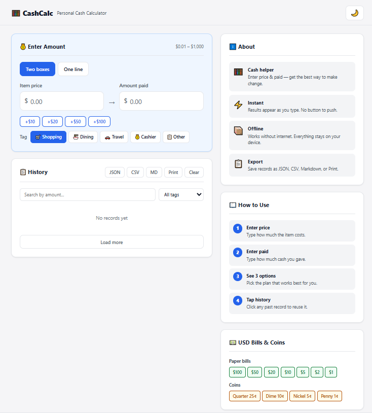

# CashCalc — Multi-Currency Cash Change Engine

[](https://for-ca.vercel.app)
[](https://for-ca.vercel.app)
[](https://www.npmjs.com/package/for-ca-core)

> **Try it live → [for-ca.vercel.app](https://for-ca.vercel.app)**
> **Install → `npm install for-ca-core`**



Enter a price and the amount paid. Get 3 optimal change breakdown strategies instantly. Supports USD, EUR, JPY, CNY.

---

## Features

- **3 strategies per calculation** — Optimal (fewest pieces), Balanced (spread across denominations), Practical (avoid tiny coins)
- **Multi-currency** — USD, EUR, JPY, CNY with correct denominations and decimal places
- **Cash inventory constraints** — Limit available banknotes/coins per denomination; engine auto-degrades when stock insufficient
- **Zero dependencies** — Pure vanilla JS. No frameworks. No build tools.
- **PWA** — Installable, works offline, keyboard shortcuts, URL sharing (`?price=X&paid=Y&currency=EUR`)
- **Export** — JSON, CSV, Markdown, Print
- **Privacy-first** — All data stays in localStorage. No server. No tracking.

## Web Demo

https://for-ca.vercel.app

The web interface is a demonstration of the core engine. Use it directly in your browser or install it as a PWA.

## Core Package

```
npm install for-ca-core
```

```js
import { calculate, CURRENCY_SETS } from "for-ca-core";

// Basic calculation
const r = calculate(23.47, 100, "USD");
// { status: "settled", balance: 76.53, plans: [...] }

// With inventory constraints
const r2 = calculate(23.47, 100, "USD", { "$20": 3, "$10": 5 });
// { inventory: { "$20": 1, "$10": 5 } } — one $20 consumed
```

See [packages/core](for-ca/packages/core) for full API docs.

## Repository Structure

```
for-ca/
├─ packages/core/       ← Reusable npm package (for-ca-core)
├─ tests/               ← Core engine tests
├─ app.js               ← Web demo UI controller
├─ index.html           ← Web demo entry
└─ style.css            ← Web demo styles
```

## License

MIT
